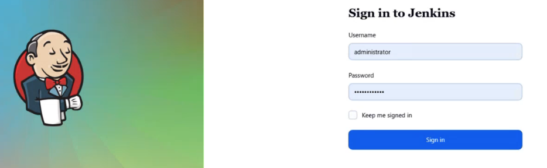
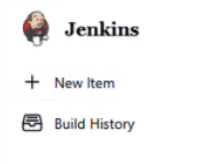
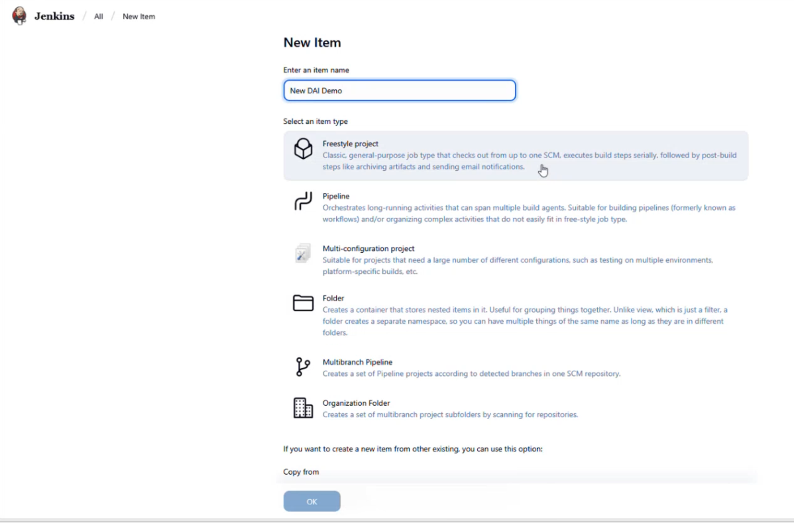
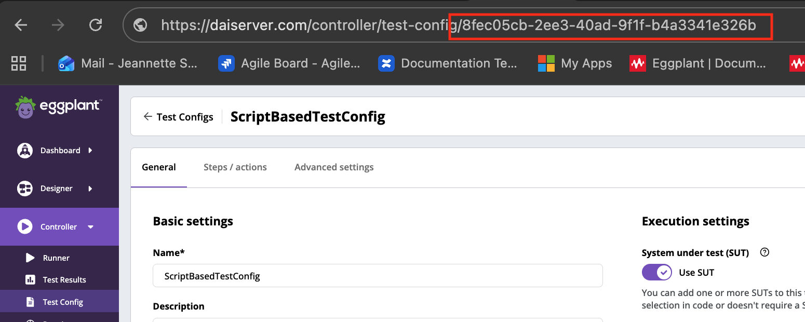
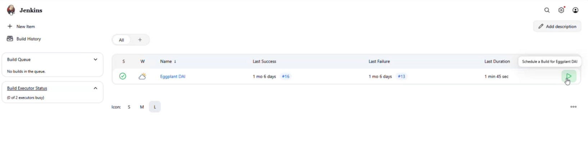
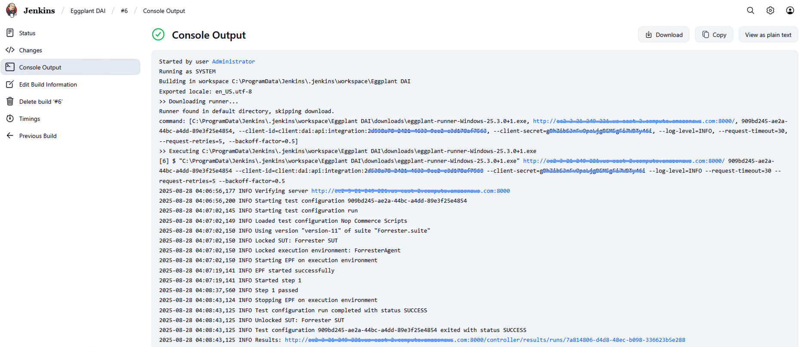

# Eggplant DAI Plugin for Jenkins

## Introduction

The [Eggplant DAI](https://www.keysight.com/us/en/products/software/software-testing/eggplant-test.html) Plugin for Jenkins works with the DAI CLI Tool (also called the *DAI Runner* in these instructions) to launch DAI tests from within a Jenkins pipeline. You can use it to continuously test your application using Eggplant's [model-based approach to testing](https://docs.eggplantsoftware.com/docs/dai-using-eggplant-dai/). For more information about Eggplant, visit <https://www.keysight.com/us/en/products/software/software-testing/eggplant-test.html>.

## Install Eggplant DAI Plugin for Jenkins

**Step 1:** Log in to your Jenkins instance

Go to your Jenkins home page and log in to your Jenkins account.



**Step 2**: Manage Jenkins

- Go to the Jenkins settings (gear icon in the upper right corner) and choose **Manage Jenkins**.

- On the **Manage Jenkins** page, under **System Configuration**, click **Plugins**.

- Click **Available plugins** under the **Plugins** menu in the left sidebar and enter **Eggplant Runner** in the search bar at the top of the page. **Eggplant Runner Plugin** should be suggested.

- Click the suggested **Eggplant Runner Plugin** to install it. You might need to restart Jenkins.

## How to use Eggplant DAI Plugin for Jenkins

### Freestyle project

**Step 1** : Create **Freestyle project**



- Click **Jenkins** in the upper left corner and then click **+ New Item**.



- On the **New Item** page, give the project a name, click **Freestyle project** under **Select an item type**, and then click **OK**.

- The project **Configuration** page opens showing the **General** options. You will leave the General options blank and configure the Build Steps.

**Step 2**: Configure **Eggplant Runner** Build Steps

- Click **Build Steps** in the Configure menu on the project Configuration page. The Build Steps page opens for you to enter information about your DAI server, test config, and client information.


**Step 3**: Fill in information about your DAI server, test config, and client information for the **Eggplant Runner** parameter values and then click **Save**. For information about where to find this information, see [Inputs](#inputs) below.

- Scroll down to see and click the **Advanced** button, where you can add more test config parameters.

## Inputs

### `serverURL`

**[Required]** The URL of the Eggplant DAI server, `http(s)://dai_server_hostname:portnumber`.

### `testConfigID`

**[Required if testConfigName is not given]** The ID of the Eggplant DAI test configuration (test config) that you want to run, for example, `389fee3e-9d6b-43e6-b31e-f1d379f27cdf`.
<br />The test config ID can be obtained by going to the **Test Config** page, looking for the test config you want to run, and obtaining the test config ID in the URL.



Alternatively, use [testConfigName](#testconfigname) and remove this input.

### `testConfigName`

**[Required if testConfigID is not given]** The name of the Eggplant DAI test configuration that you want to run.
<br />You must provide ***one*** of the following supporting arguments:

- ### `modelName`

DAI model name for the specified test config. (Use this argument if only testConfigName is provided.)

- ### `suiteName`

DAI suite name for the specified test config. (Use this argument if only testConfigName is provided.)

### `clientID`

**[Required]** The client ID to use to authenticate with the Eggplant DAI server. To get the clientID and clientSecret from DAI, go to **System > API Access**, and then create a new API key by clicking **+ New API Access**. Use the clientID and clientSecret from the new key to fill in the parameters on the Jenkins Build Steps panel.

### `clientSecret`

**[Required]** The client secret to use to authenticate with the Eggplant DAI server.<br />
             Alternatively, you could set a repo secret in `Repo Settings > Secrets > Actions` and refer to it like below:<br />
             `clientSecret: "${{ secrets.DAI_CLIENT_SECRET }}"`.

The **DAI Client Secret** can be obtain by go to  `http(s):/dai_server_hostname:portnumber/ > System > API Access > Add New`. (for new API access creation)


### `requestTimeout`

**[Optional]** The timeout in seconds for each HTTP request to the Eggplant DAI server.<br />
**Default:** `30`

### `requestRetries`

**[Optional]** The number of times to attempt each HTTP request to the Eggplant DAI server.<br />
**Default:** `5`

### `backoffFactor`

**[Optional]** The exponential backoff factor between each HTTP request.<br />
**Default:** `0.5`

### `logLevel`

**[Optional]** The logging level.<br />
**Default:** `INFO`

### `CACertPath`

**[Optional]** The path to an alternative Certificate Authority pem file.<br />

### `testResultPath`

**[Optional]** The path to a file where the test results will be stored in JUnit XML format.<br />
**Example** `C:\results\result.xml`

### `eggplantRunnerPath`

**[Optional]** The path to Eggplant Runner (CLI Tool) executable.<br />

### `parameters`

**[Optional]** The global parameter(s) to override in the format `parameter_name=parameter_value`.<br />
**Example** `username=Lily`<br />
You can override multiple parameters by separating them with a two semi-colon delimeter (`;;`).<br />
**Example** `username=Lily;;city=Paris;;hobby=Jogging`

### `parametersFilePath`

**[Optional]** The path to a user-created JSON file that contains the global parameters you want to override. <br />
Example of a parameter JSON file:

```json
{
  "MyEnvironment": "Production",
  "username": "Eggy@eggplant.com"
}
```

### `filterBy`

**[Optional]** The filters to execute specific steps within a test config in the form of `filter_name=filter_value`.<br />
**Example** `step_status_include=Failed,Error`<br />
You can enter multiple filters by separating them with a two semi-colon delimeter (`;;`).<br />
**Example** `step_status_include=Failed,Error;;test_case_name_exclude=login_user`<br />

Filter available: `step_status_include`, `step_status_exclude`, `test_case_tag_include`, `test_case_tag_exclude`, `test_case_name_include`, `test_case_name_exclude`, `scenario_tag`

### `filterByJson`

**[Optional]** The path to a user-created JSON file that contains all the filters to execute specific steps within a test configuration.<br />
Example of a test configuration's step execution filter JSON file:

```json
{
  "step_status": {
    "include": "Passed,Failed",
    "exclude": "Error,Cancelled,Untested"
  },
  "test_case_tag": {
    "include": "admin, tc_tag1",
    "exclude": "logic module, critical"
  },
  "test_case_name": {
    "include": "tc_001",
    "exclude": "login_user"
  },
  "scenario_tag": "@scea,@input_tag ~@order_page"
}
```

### `previousTaskInstanceID`

**[Optional]** The UUID of a previously executed test configu definition to be used in the current test config run. Defaults to the last ran execution of the given test config.

## Output

- On the Jenkins home page, click play to run/build the project.



- You can view the Builder information by clicking **Build History** in the left sidebar menu.

Execution details are shown in **Console Output**


## Advanced Usage

**Pipeline project**

**Step 1**: Create **Pipeline** project

**Step 2**: Copy and paste below scripts into **Pipeline script** section

```yaml
pipeline {
    agent any

    environment {
        DAI_CLIENT_SECRET = credentials('eggplant-runner-client-secret')
    }

    stages {
        stage('Eggplant Runner') {
            steps {
                // To run DAI test configuration by test config Id, use the following command
                eggplantRunner serverURL: 'Your DAI server URL', testConfigId: 'Your test configuration that want to execute', clientId: 'Your DAI client ID'
                //  To run DAI Test Configuration by Test Config Name with model name, use the following command
                // eggplantRunner serverURL: 'Your DAI server URL', testConfigName: 'Your model-based test configuration name', modelName: 'Your model name', clientId: 'Your DAI client ID'
                //  To run DAI Test Configuration by Test Config Name with suite name, use the following command
                // eggplantRunner serverURL: 'Your DAI server URL', testConfigName: 'Your script-based test configuration name', suiteName: 'Your suite name', clientId: 'Your DAI client ID'
                
                //Note: Only execute one of the command per each build step
            }
        }
    }
}
```

>:warning: **Usage of backslashes in script**: Remember to escape backslashes by replace all instances of `\` with `\\` inside a string.</br>For example, rather than:</br>`CACertPath: "C:\certs\rootCA.cer"`</br>you would use:</br>`CACertPath: "C:\\certs\\rootCA.cer"`


**Step 3**: Setup **Public Credential** for **Client Secret** -> Click **Ok**


**Step 4**: **Build** the pipeline project
Output are shown in **Console Output**


## Release for DAI

<table>
  <thead>
    <tr>
      <th width="300px">DAI Version</th>
      <th width="500px">Release</th>
    </tr>
  </thead>
  <tbody>
  <tr>
      <td>25.4.0+3</td>
      <td><a href="https://plugins.jenkins.io/eggplant-runner/">latest </a></td>
  </tr>
  <tr>
      <td>25.3.0+1</td>
      <td><a href="https://plugins.jenkins.io/eggplant-runner/"><a href="https://updates.jenkins.io/download/plugins/eggplant-runner/0.0.1.303.va_58e751ea_306/eggplant-runner.hpi"> 0.0.1.303.va_58e751ea_306 </a>(with security vulnerability fix)</td>
  </tr>
  <tr>
      <td>25.2.0+5</td>
      <td><a href="https://plugins.jenkins.io/eggplant-runner/"><a href="https://updates.jenkins.io/download/plugins/eggplant-runner/0.0.1.300.v6280c46cd670/eggplant-runner.hpi"> 0.0.1.300.v6280c46cd670 </a></td>
  </tr>
  <tr>
      <td>25.1.0+3</td>
      <td><a href="https://plugins.jenkins.io/eggplant-runner/"><a href="https://updates.jenkins.io/download/plugins/eggplant-runner/0.0.1.285.v30ff1ea_cd533/eggplant-runner.hpi"> 0.0.1.285.v30ff1ea_cd533 </a></td>
  </tr>
  <tr>
      <td>7.5.0-10</td>
      <td><a href="https://plugins.jenkins.io/eggplant-runner/"><a href="https://updates.jenkins.io/download/plugins/eggplant-runner/0.0.1.284.va_b_a_6107c0515/eggplant-runner.hpi"> 0.0.1.284.va_b_a_6107c0515 </a></td>
  </tr>
  <tr>
      <td>7.5.0-9</td>
      <td><a href="https://plugins.jenkins.io/eggplant-runner/"><a href="https://updates.jenkins.io/download/plugins/eggplant-runner/0.0.1.280.vfc393dfee9f1/eggplant-runner.hpi"> 0.0.1.280.vfc393dfee9f1 </a></td>
  </tr>
  <tr>
      <td>7.4.0-4</td>
      <td><a href="https://plugins.jenkins.io/eggplant-runner/"><a href="https://updates.jenkins.io/download/plugins/eggplant-runner/0.0.1.274.ve12295250d73/eggplant-runner.hpi"> 0.0.1.274.ve12295250d73 </a> (with cve fix)<br /><a href="https://plugins.jenkins.io/eggplant-runner/"><a href="https://updates.jenkins.io/download/plugins/eggplant-runner/0.0.1.270.vcb_9192a_2c004/eggplant-runner.hpi"> 0.0.1.270.vcb_9192a_2c004 </a>(works with 7.4.0-4)</td>
  </tr>
  <tr>
      <td>7.3.0-3</td>
      <td><a href="https://plugins.jenkins.io/eggplant-runner/"><a href="https://updates.jenkins.io/download/plugins/eggplant-runner/0.0.1.265.v56273b_eece56/eggplant-runner.hpi"> 0.0.1.265.v56273b_eece56 </a></td>
  </tr>
  <tr>
      <td>7.2.0-4</td>
      <td><a href="https://plugins.jenkins.io/eggplant-runner/"><a href="https://updates.jenkins.io/download/plugins/eggplant-runner/0.0.1.261.v52442e5f8514/eggplant-runner.hpi"> 0.0.1.261.v52442e5f8514 </a></td>
  </tr>
  <tr>
      <td>7.1.0-5</td>
      <td><a href="https://plugins.jenkins.io/eggplant-runner/"><a href="https://updates.jenkins.io/download/plugins/eggplant-runner/0.0.1.259.va_548428d4b_79/eggplant-runner.hpi"> 0.0.1.259.va_548428d4b_79 </a></td>
  </tr>
  <tr>
      <td>7.0.1-1</td>
      <td><a href="https://plugins.jenkins.io/eggplant-runner/"><a href="https://updates.jenkins.io/download/plugins/eggplant-runner/0.0.1.255.vd38258d75ca_6/eggplant-runner.hpi"> 0.0.1.255.vd38258d75ca_6 </a></td>
  </tr>
  <tr>
      <td>7.0.0-3</td>
      <td><a href="https://plugins.jenkins.io/eggplant-runner/"><a href="https://updates.jenkins.io/download/plugins/eggplant-runner/0.0.1.252.v8e47de80211e/eggplant-runner.hpi"> 0.0.1.252.v8e47de80211e </a></td>
  </tr>
  <tr>
      <td>6.5.0-3</td>
      <td><a href="https://plugins.jenkins.io/eggplant-runner/"><a href="https://updates.jenkins.io/download/plugins/eggplant-runner/0.0.1.247.va_7031a_586298/eggplant-runner.hpi"> 0.0.1.247.va_7031a_586298 </a></td>
  </tr>
   <tr>
      <td>6.4.0-5</td>
      <td><a href="https://plugins.jenkins.io/eggplant-runner/"><a href="https://updates.jenkins.io/download/plugins/eggplant-runner/0.0.1.226.v1a_ff67035775/eggplant-runner.hpi"> 0.0.1.226.v1a_ff67035775 </a></td>
  </tr>
  <tr>
      <td>6.3.0-3</td>
      <td><a href="https://updates.jenkins.io/download/plugins/eggplant-runner/0.0.1.191.v72dea_07931b_6/eggplant-runner.hpi"> 0.0.1.191.v72dea_07931b_6</a> | <a href="https://updates.jenkins.io/download/plugins/eggplant-runner/0.0.1.189.v1e3397db_cee8/eggplant-runner.hpi">0.0.1.189.v1e3397db_cee8</a></td>
  </tr>
  <tr>
      <td>6.2.1-2</td>
      <td><a href="https://updates.jenkins.io/download/plugins/eggplant-runner/0.0.1.185.v9617008ee458/eggplant-runner.hpi">0.0.1.185.v9617008ee458</a> | <a href="https://updates.jenkins.io/download/plugins/eggplant-runner/0.0.1.159.v8ed1d9f67f00/eggplant-runner.hpi">0.0.1.159.v8ed1d9f67f00</a></td>
  </tr>
  <tr>
      <td>6.1.2-1</td>
      <td><a href="https://updates.jenkins.io/download/plugins/eggplant-runner/0.0.1.108.v32f1564b_19d0/eggplant-runner.hpi">0.0.1.108.v32f1564b_19d0</a></td>
  </tr>
  </tbody>
</table>

## License

This plug-in is licensed under the terms of the [MIT license](LICENSE.md)

## Notes

1. Release DAI 7.5.0-10 now allows passes after re-run.
2. For pipeline project in Mac, if `parameters`/`filterBy` input having quotes `"`, they need to be escaped.

## Contributing

You need to install the following dependencies if you want to contribute to the Eggplant DAI Runner for Jenkins:

1. You can download and install Java 17 from the [Eclipse Temurin website](https://adoptium.net/). **(*IMPORTANT* Java is not necessary to run this plugin; you only need to install it if you want to contribute to the plugin project.)**
2. Download Maven from the [Apache Maven website](https://maven.apache.org/). Make sure to download one of the binary archives (with bin in their name).
3. To verify that Maven is installed, run the following command: `mvn -version`
4. You can use `launch.json` to run 'Debug (Attach)' to launch an local Jenkins instance for development.
